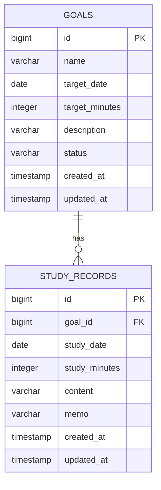

# StudyPath 最小版 — 要件定義・基本設計

## 1. 概要

### 1.1 目的

IT資格や技術を学ぶユーザーが、学習目標と日々の学習記録を登録し、学習量を確認できるWebアプリを作成する。

最小版では、**目標を作る → 学習を記録する → 学習時間と進捗を確認する**という一連の流れを完成させる。

### 1.2 想定ユーザー

- IT資格の取得を目指す初学者
- Javaなどの技術を学習中の新人エンジニア
- 自分の学習時間を管理したい個人

### 1.3 対象外（最小版では実装しない）

- ユーザー登録・ログイン・複数ユーザー対応
- JWT認証
- 学習計画・カレンダー
- 継続学習日数・グラフ・通知
- 振り返り、CSV出力、クラウド公開

## 2. 技術構成

| 区分 | 使用技術 |
| --- | --- |
| バックエンド | Java 21、Spring Boot 3 |
| 画面 | Thymeleaf、HTML、CSS、Bootstrap |
| データベース | PostgreSQL |
| DBアクセス | Spring Data JPA |
| ビルド | Gradle |
| テスト | JUnit 5、Mockito |
| バージョン管理 | Git、GitHub |

最小版では、Spring BootがHTMLを返す構成を採用する。REST APIとReactによるフロントエンド分離は、第2版の改修テーマとする。

## 3. 機能要件

### 3.1 学習目標管理

ユーザーは、取得したい資格や習得したい技術を学習目標として管理できる。

| 項目 | 内容 | 必須 |
| --- | --- | --- |
| 目標名 | 例：基本情報技術者試験、Java Silver | 必須 |
| 目標日 | 合格・達成予定日 | 任意 |
| 目標学習時間 | 目標とする学習時間（分） | 任意 |
| 説明 | 学習範囲や方針のメモ | 任意 |
| ステータス | 学習中、達成済み | 必須 |

#### 操作

- 学習目標を登録できる
- 学習目標を一覧表示できる
- 学習目標の詳細を確認できる
- 学習目標を編集・削除できる
- 学習目標を達成済みに変更できる

#### 表示・計算

- 目標一覧には、目標名、ステータス、目標日、目標学習時間、累計学習時間、進捗率を表示する
- 進捗率は目標学習時間を設定した場合のみ表示する
- 進捗率は100%を上限とする

```text
進捗率 = 累計学習時間 ÷ 目標学習時間 × 100
```

### 3.2 学習記録管理

ユーザーは、実際に取り組んだ学習を記録できる。

| 項目 | 内容 | 必須 |
| --- | --- | --- |
| 学習目標 | 紐づける目標 | 必須 |
| 学習日 | 学習した日 | 必須 |
| 学習時間 | 分単位 | 必須 |
| 学習内容 | 例：Javaの例外処理を学習 | 必須 |
| メモ | 疑問点、次にやること | 任意 |

#### 操作

- 学習記録を登録できる
- 学習記録を新しい順に一覧表示できる
- 学習記録を編集・削除できる
- 目標詳細画面で、その目標の記録だけを表示できる

#### 入力制約

- 学習時間は1〜1,440分とする
- 未来日を指定できない
- 学習内容は1文字以上100文字以内とする
- 学習目標を選択しないと登録できない

### 3.3 ダッシュボード

トップ画面に、以下を表示する。

- 登録済み目標数
- 学習中の目標一覧（累計学習時間・進捗率を含む）
- 直近5件の学習記録
- 今日の学習時間
- 今月の学習時間

## 4. 画面設計

| 画面 | URL | 主な内容 |
| --- | --- | --- |
| ダッシュボード | `/` | 集計、学習中目標、直近記録 |
| 目標一覧 | `/goals` | 目標の一覧、作成への導線 |
| 目標作成 | `/goals/new` | 目標の入力フォーム |
| 目標詳細 | `/goals/{id}` | 目標、進捗、対象の学習記録 |
| 目標編集 | `/goals/{id}/edit` | 目標の編集フォーム |
| 学習記録一覧 | `/study-records` | 学習記録の一覧 |
| 学習記録作成 | `/study-records/new` | 学習記録の入力フォーム |
| 学習記録編集 | `/study-records/{id}/edit` | 学習記録の編集フォーム |

### 4.1 画面遷移

```text
ダッシュボード
 ├─ 目標一覧 ──→ 目標作成
 │               └─→ 目標詳細 ──→ 目標編集
 └─ 学習記録一覧 ──→ 学習記録作成
                     └─→ 学習記録編集
```

## 5. データ設計

### 5.1 ER図



### 5.2 テーブル定義

#### `goals`

| カラム | 型 | 制約 | 内容 |
| --- | --- | --- | --- |
| id | BIGINT | PK、採番 | 目標ID |
| name | VARCHAR(100) | NOT NULL | 目標名 |
| target_date | DATE | NULL | 目標日 |
| target_minutes | INTEGER | NULL、1以上 | 目標学習時間（分） |
| description | VARCHAR(500) | NULL | 説明 |
| status | VARCHAR(20) | NOT NULL | `IN_PROGRESS` / `COMPLETED` |
| created_at | TIMESTAMP | NOT NULL | 作成日時 |
| updated_at | TIMESTAMP | NOT NULL | 更新日時 |

#### `study_records`

| カラム | 型 | 制約 | 内容 |
| --- | --- | --- | --- |
| id | BIGINT | PK、採番 | 学習記録ID |
| goal_id | BIGINT | FK、NOT NULL | 紐づく目標ID |
| study_date | DATE | NOT NULL | 学習日 |
| study_minutes | INTEGER | NOT NULL、1〜1,440 | 学習時間（分） |
| content | VARCHAR(100) | NOT NULL | 学習内容 |
| memo | VARCHAR(500) | NULL | メモ |
| created_at | TIMESTAMP | NOT NULL | 作成日時 |
| updated_at | TIMESTAMP | NOT NULL | 更新日時 |

削除された目標に紐づく学習記録も削除する（JPAの `CascadeType.REMOVE` を利用する）。

## 6. 基本設計

### 6.1 アーキテクチャ

```text
Browser
   ↓ HTTP
Controller        : リクエスト受付、画面・リダイレクトの返却
   ↓
Service           : 業務ロジック、集計、トランザクション管理
   ↓
Repository        : DB操作
   ↓
PostgreSQL
```

### 6.2 パッケージ構成

```text
com.example.studypath
├─ controller
│  ├─ DashboardController.java
│  ├─ GoalController.java
│  └─ StudyRecordController.java
├─ service
│  ├─ DashboardService.java
│  ├─ GoalService.java
│  └─ StudyRecordService.java
├─ repository
│  ├─ GoalRepository.java
│  └─ StudyRecordRepository.java
├─ entity
│  ├─ Goal.java
│  ├─ GoalStatus.java
│  └─ StudyRecord.java
├─ form
│  ├─ GoalForm.java
│  └─ StudyRecordForm.java
├─ dto
│  └─ DashboardDto.java
└─ exception
   └─ ResourceNotFoundException.java
```

`Entity` はDBの構造を表し、画面からの入力値は `Form` クラスで受け取る。Controllerに業務ロジックを書かず、Serviceに集約する。

### 6.3 主要処理

#### 学習記録の登録

```text
1. ユーザーが入力フォームを送信する
2. Controllerが入力値を検証する
3. StudyRecordServiceが対象Goalの存在を確認する
4. StudyRecordを保存する
5. 目標詳細画面へリダイレクトする
6. 画面で累計時間・進捗率を再計算して表示する
```

#### ダッシュボード集計

```text
1. GoalRepositoryから学習中の目標を取得する
2. StudyRecordRepositoryから今日・今月・直近5件の記録を取得する
3. 目標ごとに累計学習時間と進捗率を計算する
4. DashboardDtoにまとめ、画面へ渡す
```

### 6.4 Repositoryの主なメソッド例

```java
List<StudyRecord> findTop5ByOrderByStudyDateDescCreatedAtDesc();

List<StudyRecord> findByGoalIdOrderByStudyDateDesc(Long goalId);

@Query("SELECT COALESCE(SUM(s.studyMinutes), 0) " +
       "FROM StudyRecord s WHERE s.goal.id = :goalId")
int sumStudyMinutesByGoalId(Long goalId);
```

## 7. バリデーション・例外設計

| 対象 | ルール | 表示メッセージ例 |
| --- | --- | --- |
| 目標名 | 必須、100文字以内 | 目標名を入力してください。 |
| 目標学習時間 | 入力時は1分以上 | 目標学習時間は1分以上で入力してください。 |
| 学習日 | 必須、未来日不可 | 学習日は今日以前の日付を指定してください。 |
| 学習時間 | 必須、1〜1,440分 | 学習時間は1〜1,440分で入力してください。 |
| 学習内容 | 必須、100文字以内 | 学習内容を入力してください。 |

URLのIDに該当するデータが存在しない場合は、`ResourceNotFoundException` を送出して404画面を表示する。

## 8. テスト方針

| 対象 | 確認内容 |
| --- | --- |
| GoalService | 目標の作成、更新、削除、存在しないIDの例外 |
| StudyRecordService | 記録の作成、目標との紐づけ、削除 |
| DashboardService | 今日・今月・目標別の学習時間集計 |
| Controller | 正常時の画面遷移、バリデーションエラー時の表示 |

最低限、目標のCRUD、学習記録のCRUD、進捗率計算には単体テストを用意する。

## 9. 完了条件

- 目標と学習記録のCRUDができる
- 学習記録は目標へ正しく紐づく
- 目標別の累計時間と進捗率が正しく表示される
- ダッシュボードで今日・今月の学習時間を確認できる
- PostgreSQLへデータが保存される
- バリデーションと404画面が機能する
- READMEに起動方法、技術構成、ER図、画面一覧を記載する

## 10. 次のバージョンでの拡張候補

1. Spring BootのREST API化
2. React + TypeScriptによるフロントエンド分離
3. Spring SecurityとJWTによる認証
4. カレンダー形式の学習計画
5. 継続学習日数とChart.js等のグラフ
6. Docker Compose、GitHub Actions、クラウド公開
